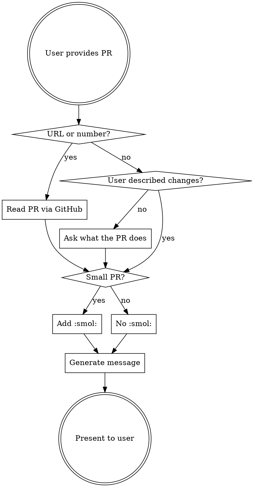

# Share PR for Review

Generates a ready-to-paste Slack message for requesting PR review in #team-frontend, matching the team's established conventions.

## Input

The user provides one of:
- A GitHub PR URL
- A PR number + repo name
- A description of changes (if PR isn't created yet)

If only a URL is provided, read the PR to understand the changes before generating the message.

## Output Format

```
:[emoji]: [optional :smol:] <PR_URL|optional display text>
• lowercase summary bullet 1
• lowercase summary bullet 2 (if needed)
```

### Emoji Selection

| Situation | Emoji |
|-----------|-------|
| Open PR for review (default) | `:open-pr:` |
| Already merged, sharing FYI | `:merged-pr:` |

### Size Indicator

Add `:smol:` immediately after the PR emoji when the PR is small — roughly under 50 lines changed, single-concern fix, or the user says it's small.

```
:open-pr: :smol: <URL|title>        ← small PR
:open-pr: <URL|title>               ← normal PR
```

### Link Format

Use Slack's hyperlink syntax: `<URL|display text>`

Display text options (pick what fits):
- **PR title** from GitHub (most common): `<URL|fix: missing org id lint error>`
- **Bare URL** if title isn't informative: `<URL>`

### Bullet Points

- 1-2 bullets for small/medium PRs, up to 4-5 for large ones
- Lowercase, no trailing periods
- Concise and technical — describe what changed and why, not the full PR description
- Use backticks for code references: \`functionName\`, \`component\`
- Indent sub-bullets with 4 spaces + `◦` for additional context

### Optional Extras

Only include if relevant — don't force these:
- **cc reviewers**: `cc @person` at the end if targeting specific reviewers
- **Related links**: link to Linear tickets, related threads, or dependent PRs
- **Context**: brief note like "builds off this pr" or "one of the last ones for a while"

## Examples

**Small fix:**
```
:open-pr: :smol: <https://github.com/supabase/supabase/pull/43642|fix: missing org id lint error> - there's a type gone rogue with the next openapi specs
```

**Standard PR with bullets:**
```
:open-pr: <https://github.com/supabase/supabase/pull/43617>
• fixes a double-encoding bug in the first-referrer cookie where `serializeFirstReferrerCookie` was calling `encodeURIComponent` on top of `Next.js cookies.set()` already encoding
• removes the redundant encode on the write side and adds a fallback decode on the read side for legacy cookies
```

**PR with sub-bullets for a bigger change:**
```
:open-pr: <https://github.com/supabase/supabase/pull/43545>
• initial groundwork for Supamarket, mainly setting up pulling in integrations from a remote source
    ◦ changes are feature flagged - priority for review is to ensure behaviour is status quo if flag is off
    ◦ large LOC diff is just the types file from the supabase project
• more details in the PR, related linear project <https://linear.app/supabase/project/supamarket|here>
```

**Small PR, two bullets:**
```
:open-pr::smol: <https://github.com/supabase/supabase/pull/43641>
• adds endpoint to query status of banner override env var
• needed for banner bot to determine whether an override is in place
```

## Process



## Tone Guide

- Casual, technical, concise — like a thoughtful Slack message to teammates
- No corporate language ("I'd like to request a review of...")
- No emojis in the bullet text (emojis only in the prefix line)
- Don't over-explain — trust the PR description to fill in details
- If the user wants to cc someone or add context, include it naturally after the bullets

## What NOT to Do

- Don't wrap the output in a code block (the user needs to paste it raw into Slack)
- Don't add a greeting or sign-off ("Hey team!", "Thanks!")
- Don't use `:pr:` or `:new-pull-request:` — stick to `:open-pr:` for consistency
- Don't add trailing periods to bullets
- Don't capitalize the first word of bullets (unless it's a proper noun or code)
